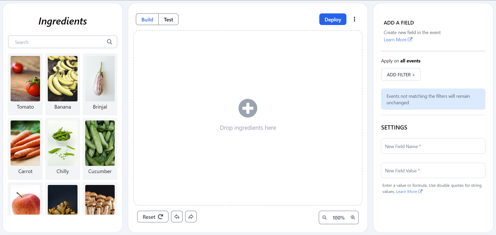

# Recipe Builder application using React Js

## Overview
Recipe Builder is a user-friendly web application designed for cooking enthusiasts of all levels. Whether you're a seasoned chef or a home cook, this tool simplifies the process of creating, managing, and sharing recipes.

---
## Technologies Used

- React
- TailwindCSS
- Context API
- JSON (Downloadable format)

---
## Demo image


---
## Features

- **Create Recipes:** Easily drag and drop ingredients, steps, and cooking tips.
- **Manage Recipes:** Organize your recipes in a structured format.
- **Drag and Drop:** Intuitively rearrange ingredients and steps using drag-and-drop functionality.
- **Download & Share Recipes:** Download the recipe in JSON format and you can share your favorite recipes with friends and family.
- **User-Friendly Interface:** Intuitive design that makes recipe building enjoyable.

---
## Who It's For

This application is perfect for:
- Home cooks looking to organize their favorite recipes.
- Professional chefs who want to document and share their culinary creations.
- Anyone who loves cooking and wants to streamline their recipe-building process.

---
## Run The Application Locally

### Prerequisites

Before you begin, ensure you have met the following requirements:
- **Node.js** (version 16 or above)
- **npm** (version 6 or above)
- A modern **web browser** (e.g., Chrome, Firefox)

---
### Installation

To get a local copy up and running, follow these steps:

Clone the repository:
```bash
git clone https://github.com/sanjithrk06/RecipeBuilder.git
```

Navigate to the project directory:
```bash
cd RecipeBuilder
```

Install dependencies:
```bash
npm install
```
    
---
### Run The Application

Start the application

```bash
  npm run dev
```

---
*Feel free to reach out through the contact form in [My Portfolio](https://sanjith-portfolio.netlify.app/) or connect with me on social media.